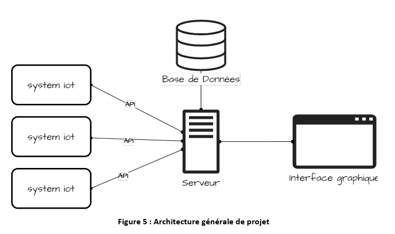
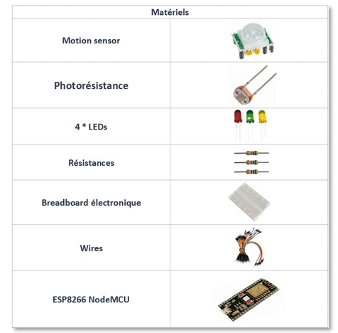
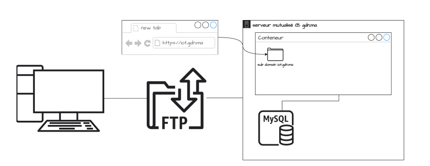

# Projet de PFE IoT
> **Pour plus de détails, consultez les sections du rapport que vous devez connaître**

Dans ce projet, nous explorons le concept de l'Internet des objets (IoT) et nous nous concentrons sur la conception d'un prototype de bureau intelligent, appelé "Smart Office", basé sur cette technologie. L'objectif principal est d'optimiser la consommation d'électricité et de mettre en place une plateforme simple à utiliser.

### Problématique :
Les bureaux sont confrontés à de nombreux défis qui peuvent être résolus par l'IoT. Les systèmes de chauffage, de refroidissement et d'éclairage obsolètes peuvent gaspiller de l'énergie, tandis qu'il peut être difficile de contrôler et de surveiller l'accès à différentes parties du bâtiment. Une mauvaise qualité de l'air et une ventilation insuffisante peuvent entraîner une diminution de la santé et de la productivité des employés, et il peut être difficile de suivre l'utilisation des équipements et des ressources. Enfin, une utilisation inefficace de l'espace peut entraîner une surpopulation ou une sous-utilisation de certaines zones. Donc, comment les nouvelles technologies peuvent optimiser ce problème ?

### Objectifs :
Les objectifs du projet sont d'intégrer des solutions IoT pour résoudre les problèmes rencontrés dans les bureaux, d'améliorer l'efficacité énergétique et de réduire les coûts opérationnels. La plateforme IoT joue un rôle essentiel dans la réalisation de ces objectifs en permettant une gestion centralisée des différentes composantes du Smart Office.

### Périmètre du projet :
Le projet consiste à :
- Allumer/éteindre la lumière [automatiquement ou manuellement]
- Détecter le mouvement et allumer/éteindre la lumière
- Régler la luminosité de la lumière
- Effectuer des opérations de gestion sur les utilisateurs/machines
- Contrôler les machines inscrites
- Visualiser les données

### Architecture :
</img>

### Technologies :
- Arduino IDE
- Circuito.io
- XAMPP
- Postman
- FileZilla Client
- Composer
- HTML
- Bootstrap
- Chart.js
- Laravel
- APIs 

### Composants :
</img>

### Déploiement :

</img>

Pour déployer notre projet, nous utilisons FTP pour transférer les fichiers du projet du PC vers le serveur partagé via le logiciel de transfert de fichiers (FTP) FileZilla Client. Le serveur partagé, associé au domaine "gdn.ma", héberge plusieurs conteneurs pour différents projets, y compris le nôtre. À l'intérieur du serveur partagé, nous avons un conteneur spécifiquement dédié à notre projet. De plus, nous avons configuré un sous-domaine appelé "iot.gdn.ma" qui pointe vers le dossier de notre projet à l'intérieur du conteneur du serveur partagé. Ce sous-domaine agit comme une adresse spécialisée pour accéder à nos fonctionnalités liées à l'IoT. En outre, le serveur partagé comprend également une base de données MySQL, utilisée pour stocker et gérer les données de notre projet de bureau intelligent IoT. L'intégration de la base de données MySQL permet un stockage et une récupération efficaces des données au sein de notre application.

